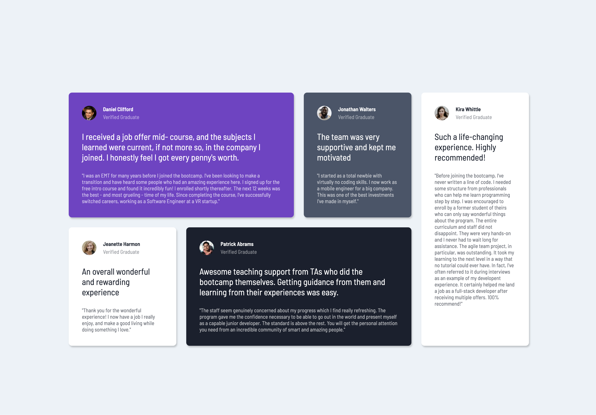

# Frontend Mentor - Testimonials grid section solution

This is a solution to the [Testimonials grid section challenge on Frontend Mentor](https://www.frontendmentor.io/challenges/testimonials-grid-section-Nnw6J7Un7). Frontend Mentor challenges help you improve your coding skills by building realistic projects. 

## Table of contents

- [Overview](#overview)
  - [The challenge](#the-challenge)
  - [Screenshot](#screenshot)
  - [Links](#links)
- [My process](#my-process)
  - [Built with](#built-with)
  - [What I learned](#what-i-learned)
  - [Useful resources](#useful-resources)
- [Author](#author)

**Note: Delete this note and update the table of contents based on what sections you keep.**

## Overview

### The challenge

Users should be able to:

- View the optimal layout for the site depending on their device's screen size

### Screenshot

### Links

- Solution URL: [https://github.com/rickMcGavin/fe-mentor-testimonials-grid](https://github.com/rickMcGavin/fe-mentor-testimonials-grid)
- Live Site URL: [Add live site URL here](https://your-live-site-url.com)

## My process

### Built with

- HTML
- CSS custom properties
- CSS Grid
- Mobile-first workflow

### What I learned

My main goal here was to build a project using CSS grid. I had put off learning it for a while, and I decided to go through the [CSS grid garden course](https://cssgridgarden.com/). To further solidify this knowledge, I found this project on Frontend Mentor and decided to build it using CSS grid.

The best thing I learned was that I can use CSS grid for some layouts that I used to use flexbox for, and I can do it with less markup. Flexbox tends to require that you wrap content in a container, and then wrap that container in another container. With CSS grid, I can just wrap the content in a single container and use grid to position it.

### Useful resources

- [CSS Grid Garden](https://cssgridgarden.com/) - This is a great resource for learning CSS grid. It's a game that teaches you how to use CSS grid. I highly recommend it.

## Author

- Website - [https://rickmcgavin.dev/](https://rickmcgavin.dev/)
- Frontend Mentor - [@rickMcGavin](https://www.frontendmentor.io/profile/rickMcGavin)
- Twitter - [@rickMcGavin](https://www.twitter.com/rickMcGavin)
